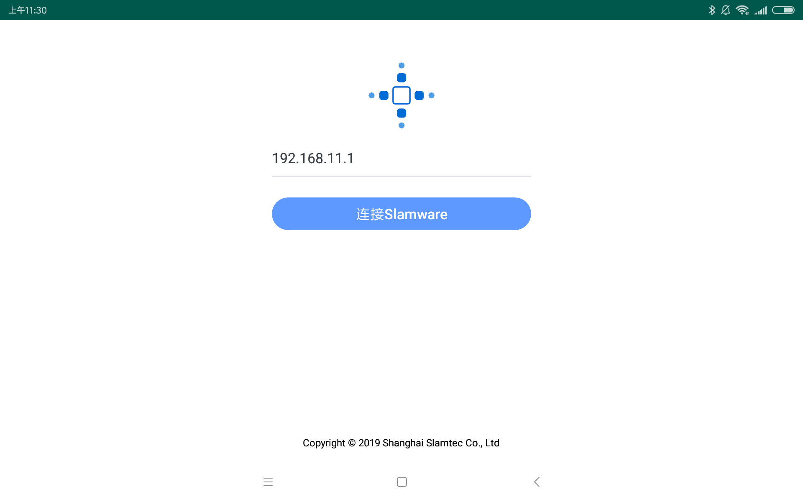
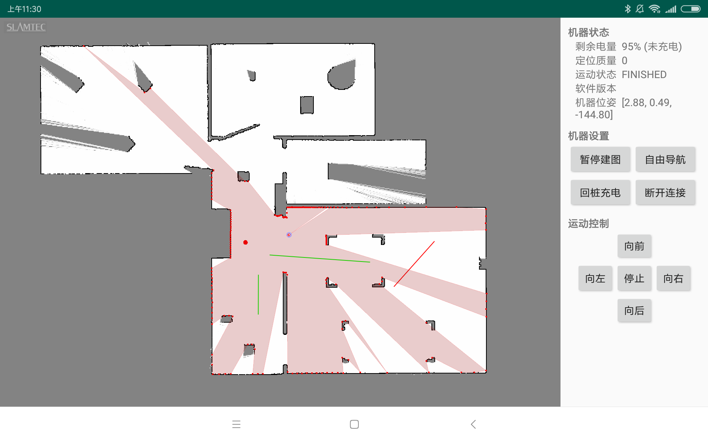

# UICommander.Android简介
本软件是基于[上海思岚科技](https://www.slamtec.com/)Slamaware SDK 的Android应用程序，旨在方面Slamware（包括通用底盘、Cube、Mapper、SDP、SDPmini）用户快速开发和应用，主要包含以下功能。

1、机器人的连接与断开；  
2、地图显示，包括Slam地图/机器人位姿/激光数据/充电桩位姿/虚拟轨道(红色)/虚拟墙(绿色)/规划路径/目标点；  
3、地图操作，包括平移/旋转/缩放/保存CompositeMap/设置CompositeMap
4、机器控制，包括行走方向控制/回桩/地图更新开关/机器到点/机器到点模式控制（自由导航/轨道导航/轨道优先）；  
5、状态显示，包括固件版本/定位质量/运动状态/软件版本/机器位姿/剩余电量/充电状态 的显示。  

# 图片视频演示
连接界面

主页面

使用视频

# 相关链接
更多思岚科技的产品信息请参考[上海思岚科技](https://www.slamtec.com/)  
更多Slamaware Android SDK 信息请看[Slamaware Android SDK](http://developer.slamtec.com/docs/slamware/android-sdk/2.6.0_rtm/)  
更多Slamaware Android Demo 请看[Slamaware Android Demo](https://github.com/SlamtecSupport/SlamwareApplicationDemos-Android)  

# 软件下载
请点击[UICommander.apk](https://github.com/SlamtecSupport/UICommander.Android/raw/master/apk/UIcommander.apk)  或扫描下方二维码下载。  

